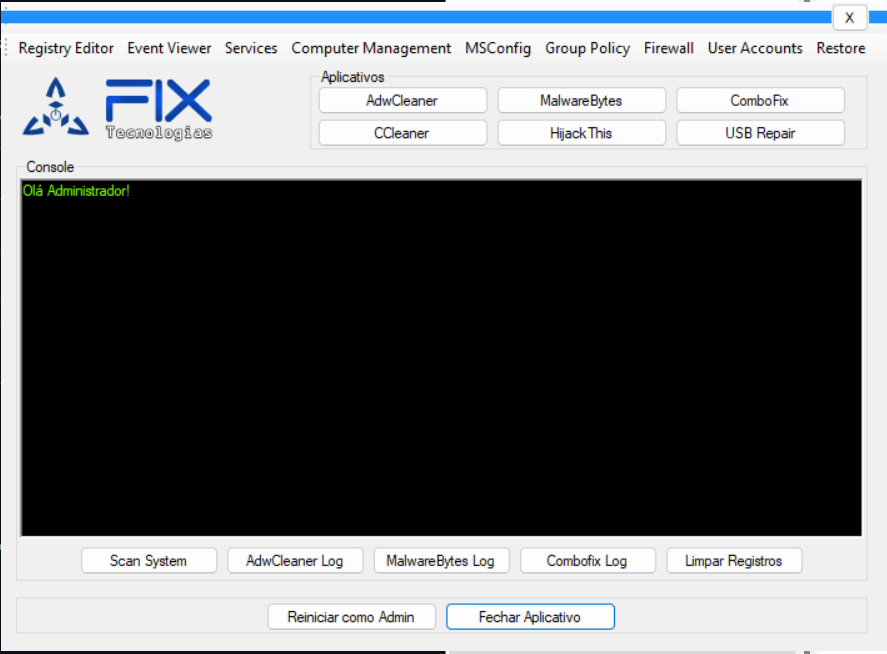

# Dr. Tools – Utility for USB Repair and System Maintenance

Dr. Tools is a C# Windows application designed to provide various system maintenance tools for administrators, including USB repair and registry cleaning. The app is designed to be user-friendly, with a console-based interface to execute various system tasks, such as malware removal and registry cleaning.

---

## ✨ Overview

The application features a graphical user interface (GUI) that includes the following tools:

* **USB Repair**: Helps fix issues related to hidden files and folders on USB drives.
* **Malware Scanner**: Scans for potential malware and allows the user to remove malicious files from the system.
* **Registry Cleaning**: Cleans traces of registry issues caused by rogue software.
* **Log Viewer**: Displays logs of the operations performed for user reference.
* **System Tools**: Provides easy access to system utilities like Task Manager, Registry Editor, Event Viewer, and more.

---

## ⚙️ Key Features

* **USB Repair**: Fix hidden files on USB drives and remove harmful files with specific extensions (e.g., `.vbs`, `.js`, `.lnk`).
* **Registry Cleaner**: Cleans up registry entries related to malware and rogue programs.
* **Malware Detection**: Provides an option to detect and delete malware files from your system.
* **Real-Time Logs**: The log section updates in real-time, providing immediate feedback on operations being performed.
* **Administrator Mode**: Some features require elevated administrator privileges for full functionality.

---

## 📦 Installation Instructions

### Prerequisites

* **.NET Framework**: Ensure that your system has the .NET Framework installed (preferably .NET 4.7.2 or later).

### Installation Steps

1. **Download the Application**
   Clone or download the ZIP of the repository.

2. **Compile the Application**

   * Open the solution in Visual Studio.
   * Build the project to generate the executable file.

3. **Run the Application**
   Simply double-click the compiled `.exe` file to launch the application. Make sure to run the application as Administrator for full functionality.

---

## 📝 Usage Instructions

1. **Launch the Application**:
   After starting the application, the main interface will appear, displaying available tools.

2. **USB Repair**:

   * Click on **"1 - Select Path..."** to choose the folder you want to repair.
   * Click **"2 - Repair"** to start the repair process. Hidden files and malicious files like `.vbs`, `.js`, and `.lnk` will be handled accordingly.

3. **Registry Cleaner**:

   * The application will automatically attempt to clean rogue registry entries when requested.
   * Log entries are shown in real-time in the console section.

4. **Log Viewer**:
   View real-time log updates in the **LOG** section at the bottom. It displays the success or failure of each action performed.

5. **Close Application**:
   You can close the application by clicking on the **"Close Application"** button at the top of the window.

---

## 📂 File Structure

```
Dr.Tools/
├─ Dr.Tools.exe                # Executable file
├─ Dr.Tools.sln                # Visual Studio Solution File
├─ frmAdministrador.cs          # Admin interface code
├─ frmUSBRepair.cs             # USB repair tool code
├─ frmUSBRepair.Designer.cs    # Designer for the USB repair form
├─ frmUSBRepair.resx           # Resources for the USB repair form
├─ frmAdministrador.designer.cs # Designer for the admin form
└─ README.md                   # This file
```

---

## 🖼️ Application Screenshots



---

## 🛠️ License

This project does not have a formal license yet. A suggestion would be to use either the MIT License or Apache-2.0. Please open an issue for discussion.

---

Developed by \Thiago Scheffer - 2014
---
